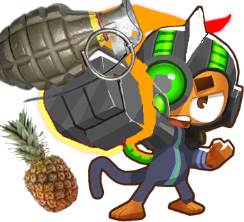

<h1 align="center">BoomerangMonkeyFourthPath</h1>

Adds the boomerang monkey fourth path, focused on explosions and mass MOAB destruction. Spent more time on this mod so there is custom textures, displays, and even portraits.

